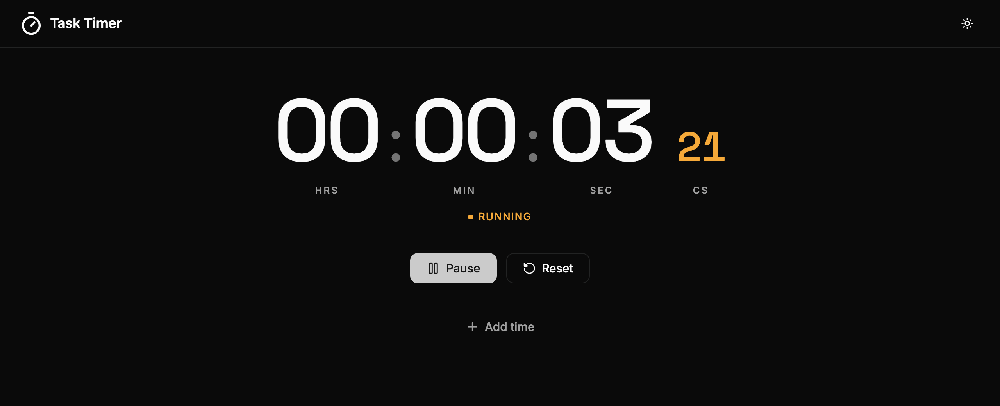
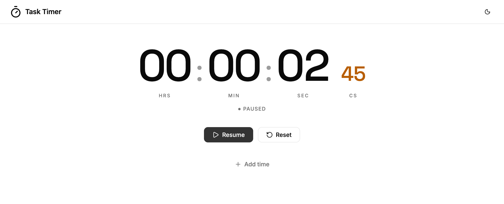
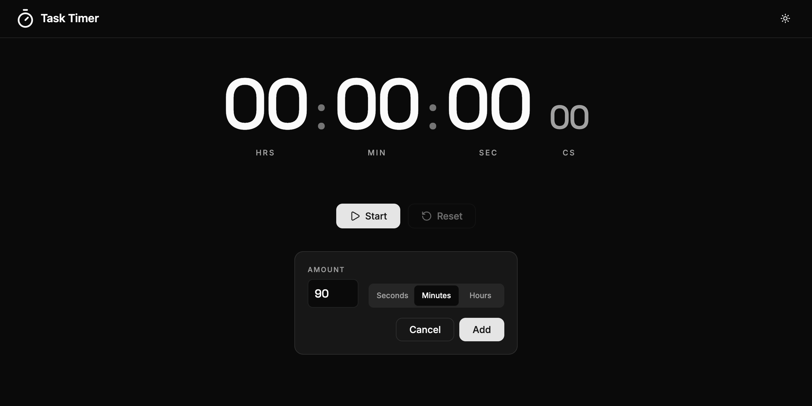
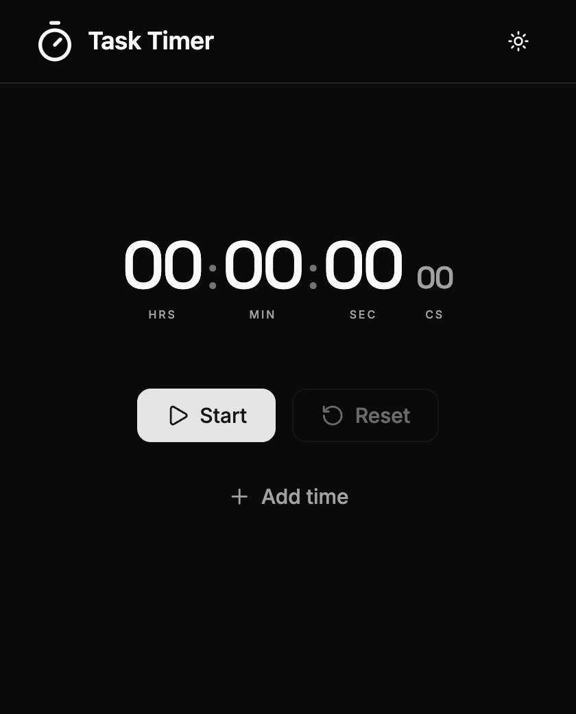

# task-timer

### ▶ [timer.ruchij.com](https://timer.ruchij.com)

A stopwatch web app. Stamped from [`ruchira088/react-template`](https://github.com/ruchira088/react-template): React 19 + React Router 8 (SPA, no SSR) on Node 24, Vite 8, Vitest 4, TypeScript 7, oxlint, Tailwind CSS v4 + shadcn/ui, Zod 4, Sentry, Ansible playbooks for build artefacts and Docker, multi-stage GitHub Actions pipeline, and CDK deployment via the `react-app-cdk-deploy` library.



## The timer

`app/components/timer/Timer.tsx` is the whole feature, rendered by `HomePage` under `AppLayout`:

- Start / Pause / Resume / Reset, counting in centiseconds off a 10 ms interval anchored to `Date.now()` (not an accumulating tick, so it doesn't drift).
- **Add time** injects an offset in seconds, minutes or hours; the offset is folded into the elapsed total and survives pause/resume.
- The elapsed time is mirrored into `document.title`, with a `(Paused)` suffix when stopped.
- Centiseconds sit in a smaller **sub-register**, the way a chronograph separates its split-second dial, and carry the only saturated colour — so the fastest-moving digits don't lead the composition.
- Numerals are set in **Space Grotesk** with tabular figures: fixed-width digits can't jitter as the display ticks ten times a second, and its zero has no dot or slash through it.
- Layout responds to **container queries** — `HomePage.module.scss` declares `container-type: inline-size` and `Timer.module.scss` sizes the display in `cqi` units, against the container rather than the viewport.

Paused mid-run, light theme — the theme follows the toggle in the header and persists to localStorage:



**Add time** open, with 90 minutes staged. `Add` stays disabled until the amount parses to a positive number:



At a narrow width the container queries scale the display down rather than wrapping it:



## Outstanding follow-ups

Carried over from the template — none of them block local development.

- **Sentry**: `app/services/Sentry.ts` still has empty DSN placeholders, which disables Sentry per environment. Create dev/staging/prod projects and paste the DSNs in to enable it.
- **GitHub environments**: the workflow gates deploys on `Staging` and `Production` environments — create them in the repo settings.
- **Hosted zone**: `cdk-deploy/cdk.context.json` is not checked in; the first `cdk synth` populates it with the Route53 lookup for `ruchij.com`.

## Project layout

```
.github/workflows/build-pipeline.yml   transpile/test -> S3 upload -> docker -> cdk deploy -> release
app/
  app.css                              Tailwind v4 entrypoint + shadcn CSS variables (light/dark)
  index.scss                           HydrateFallback loading-screen styles only
  components/timer/                    the stopwatch: Timer.tsx + Timer.module.scss
  components/ui/                       shadcn primitives (Button)
  components/ThemeToggle.tsx           sun/moon toggle wired to the config provider
  lib/utils.ts                         `cn` helper (clsx + tailwind-merge)
  pages/AppLayout.tsx                  header (stopwatch glyph + theme toggle) wrapping the routes
  pages/HomePage.tsx                   renders the Timer; owns the container-query wrapper
  providers/                           ApplicationConfigurationProvider (theme + safe-mode context, toggles `.dark` on `<html>`)
  services/
    Config.ts                          environment detection by hostname (used by Sentry)
    Sentry.ts                          DSN-per-env init (placeholders)
    config/                            localStorage-backed app config
    kv-store/                          generic typed localStorage abstraction
  models/                              ApplicationConfiguration Zod schema
  types/                               Option
cdk-deploy/                            wraps github:ruchira088/react-app-cdk-deploy
playbooks/                             ansible: s3 upload, docker build/publish, github release
scripts/
  env-vars.mjs                         injects VITE_GIT_BRANCH/VITE_GIT_COMMIT at build
tests/                                 mirrors app/; vitest + jsdom + testing-library
```

## Styling & UI

- **Tailwind v4** is wired via `@tailwindcss/vite` in `vite.config.ts`. There is no `tailwind.config.*` — design tokens live as CSS variables in `app/app.css` under `:root` and `.dark`.
- **shadcn/ui** components are owned source, not a dependency. Add more with `npx shadcn@latest add <component>`; `components.json` is already set up (`~/components/ui`, `~/lib/utils`, neutral base color).
- **Dark mode** is class-based (`.dark` on `<html>`). The toggle in `AppLayout`'s header writes through `useApplicationConfiguration().setTheme`, which persists to localStorage and applies the class.
- **Type** pairs Space Grotesk (timer numerals, loaded in `app/root.tsx`) with Inter for UI chrome.
- **Icons** are from `lucide-react`, including the stopwatch glyph in the header.

## Dependencies

Requires Node **24** (`engines.node: ^24.0.0`). Versions are the ranges declared in `package.json`; update this section whenever they change.

### Runtime

| Package | Version | Used for |
| --- | --- | --- |
| `react`, `react-dom` | `^19.2.8` | — |
| `react-router` | `^8.3.0` | SPA routing (`app/routes.ts`) |
| `isbot` | `^5.2.1` | not imported by app code, but **required** — `react-router typegen` re-adds it to `package.json` if it's missing |
| `@radix-ui/react-slot` | `^1.3.3` | the primitive behind the shadcn `button` |
| `class-variance-authority` | `^0.7.1` | variant definitions in `app/components/ui/button.tsx` |
| `clsx`, `tailwind-merge` | `^2.1.1`, `^3.6.0` | the `cn` helper in `app/lib/utils.ts` |
| `tailwindcss`, `@tailwindcss/vite` | `^4.3.3` | styling; no `tailwind.config.*` |
| `tw-animate-css` | `^1.4.0` | imported at the top of `app/app.css` |
| `lucide-react` | `^1.27.0` | icons |
| `zod` | `^4.4.3` | the `ApplicationConfiguration` schema in `app/models/` |
| `luxon` | `^3.7.2` | build timestamp in `scripts/env-vars.mjs` (build-time only, but a runtime dep by convention) |
| `@sentry/react` | `^10.68.0` | `app/services/Sentry.ts`, error capture in `app/root.tsx` |

Every runtime dependency above is either imported by `app/` or required by the build. `axios` and `@radix-ui/react-label` were dropped along with the auth/API layer, and `@types/luxon` with the unused `Zod`/`Formatter` helpers; `@dnd-kit/*`, `classnames` and `@react-router/node` were already removed as unused by the template — add `@dnd-kit` back if a project needs drag-and-drop, and reach for `cn` (`clsx` + `tailwind-merge`) rather than reinstalling `classnames`. `@react-router/node` is still installed transitively by `@react-router/dev`, so nothing needs it declared here.

### Dev

| Package | Version | Used for |
| --- | --- | --- |
| `@react-router/dev` | `^8.3.0` | dev server, typegen, `react-router build` |
| `vite` | `^8.1.5` | bundler (`vite.config.ts`) |
| `typescript` | `^7.0.2` | native (Go) `tsc` — see [Toolchain notes](#toolchain-notes) |
| `oxlint` | `^1.75.0` | linting (`.oxlintrc.json`) |
| `vitest`, `@vitest/coverage-v8`, `jsdom` | `^4.1.10`, `^4.1.10`, `^29.1.1` | tests + coverage in a DOM environment |
| `@testing-library/react`, `@testing-library/jest-dom`, `@testing-library/user-event` | `^16.3.2`, `^7.0.0`, `^14.6.1` | component tests (`tests/setup.ts`) |
| `sass-embedded` | `^1.100.0` | compiles the SCSS modules and `app/index.scss` |
| `simple-git` | `^3.36.0` | `scripts/env-vars.mjs` reads branch/commit |
| `@types/node`, `@types/react`, `@types/react-dom` | `^24.12.2`, `^19.2.17`, `^19.2.3` | type definitions |

### `cdk-deploy/`

Separate `package.json`, installed independently: `aws-cdk` `^2.1133.0`, `react-app-cdk-deploy` (`github:ruchira088/react-app-cdk-deploy#v1`), plus `tsx` `^4.23.1`, `typescript` `^7.0.2` and `@types/node` `^24.13.3` as dev dependencies. It runs `tsx` rather than `ts-node` because TypeScript 7 removed the classic compiler API.

## Toolchain notes

Worth knowing before you add tooling to this project.

- **TypeScript 7** is the native (Go) compiler. `tsc` is a native binary, and the `typescript` package no longer exposes the classic compiler API (`createProgram`, `SyntaxKind`, …) — that now lives behind a separate `typescript/unstable/*` surface. Tools built against the old API therefore **fail outright** on TS 7 rather than degrading. If you hit one, Microsoft documents a side-by-side install (`@typescript/typescript6`, exposed as `tsc6`) as the escape hatch.
- **Linting is [oxlint](https://oxc.rs)**, configured in `.oxlintrc.json`. It's Rust-based and doesn't use the TypeScript compiler API, which is exactly why it works with TS 7. `typescript-eslint` is not an option here — every published version caps TypeScript at `<6.1.0` and errors on TS 7 ([tracking issue](https://github.com/typescript-eslint/typescript-eslint/issues/10940)) — so the ESLint stack isn't installed. There are no type-aware lint rules; `tsc` is the source of truth for types.
- **The `~/*` → `app/*` alias** is declared in `tsconfig.json` and resolved by Vite natively (`resolve: { tsconfigPaths: true }`), set in both `vite.config.ts` and `vitest.config.ts`. No `vite-tsconfig-paths` plugin — a new Vite-based config needs that `resolve` block or `~/` imports won't resolve.

## Common scripts

```bash
npm run start          # dev server
npm run start:dev      # dev server pointing at PROD API
npm run start:local    # dev server pointing at https://api.localhost
npm run start:staging  # dev server pointing at staging API
npm run typecheck      # react-router typegen + tsc (TypeScript 7)
npm run lint           # oxlint over app/ and tests/
npm run lint:fix       # oxlint --fix
npm run test           # vitest watch
npm run test:coverage
npm run build          # react-router build
npm run ci:checks      # typecheck + lint + test:coverage
```

## Deployment flow

1. Push to any branch -> `transpile-and-test` runs.
2. On success -> bundle uploaded to S3, Docker image pushed to ghcr.
3. Branch != `main` -> deploys to `<branch>.timer.ruchij.com` via CDK.
4. Branch == `main` -> deploys to `staging.timer.ruchij.com`, then `timer.ruchij.com` (gated on the `Production` GitHub environment), then creates a GitHub release.

The npm package, CDK stack (`TaskTimerFrontEndStack`) and artefact bucket (`task-timer-bundles.ruchij.com`) are named `task-timer`, but the deployed host is the shorter, pre-existing `timer.ruchij.com`.
